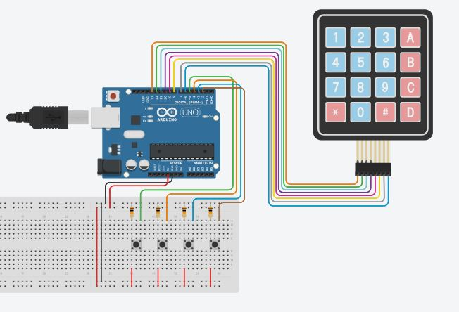
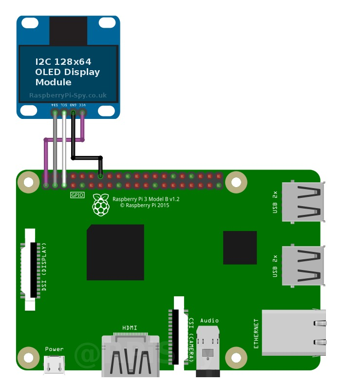

# TE2003_MP3_Player
  

This app is an implementation of a music reproductor for Windows using pygames and PyQt5. It works well with mouse clicks and you can create a electrical circuits for a external use.
To be able to use the application correctly we will have to download different libraries from the terminal.

### [MP3 Demo](https://drive.google.com/file/d/1fAL5woXjTIME7PsP_ZVAGOoKbWKi1t5D/view?usp=sharing)

## Requirements
* python
* pygame
* PyQt5.

## Platform
Currently this aplication is tested and run successfully on windows and raspbian.

## Instalation
Installation of PyQt5 on Raspbian:

sudo apt-get update

sudo apt-get install qt5-default 

pyqt5-dev pyqt5-dev-tools

Installation of Pygames on Raspbian:

sudo apt-get install python-pip

sudo pip install pygame

Installation of PyQt5 on Windows:

pip install pyqt5-tools

Installation of Pygames on Raspbian:

pip install pygame
